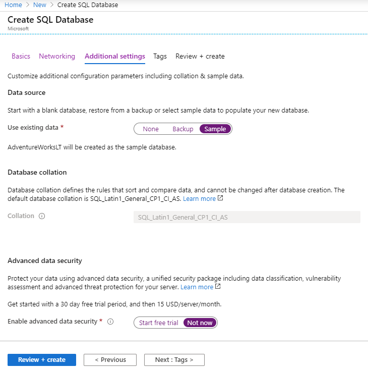

# 06 - Create a SQL database

In this walkthrough, we will create a SQL database in Azure and then query the data in that database.

# Task 1: Create the database

In this task, we will create a SQL database based on the AdventureWorksLT sample database. 

1. Click on the Azure Portal icon on the VM desktop and login with the Azure credentials from the Lab Environment output page.

2. From the **All services** blade, search for and select **SQL databases**, and then click **+ New**. 

3. On the **Basics** tab, fill in this information.  

    | Setting | Value | 
    | --- | --- |
    | Subscription | **Choose your subscription** |
    | Resource group | **myRGDb-[DeploymentId]** (use existing) |
    | Database name| **db1** | 
    | | |

    **Note**: Deployment ID can be obtained from the Lab Environment output page.

3. Next to the **Server** drop down list, click **Create new** and enter this information (replace **xxxx** in the name of the server with the deployment ID). Click **OK** when finished.          

    | Setting | Value | 
    | --- | --- |
    | Server name | **sqlserverxxxx** (must be unique) | 
    | Server admin login | **sqluser** |
    | Password | **Pa$$w0rd1234** |
    | Location | **(US) East US** |
    | | |

   

4. Move to the **Networking** tab and configure the following settings (leave others with their defaults) 

    | Setting | Value | 
    | --- | --- |
    | Connectivity method | **Public endpoint** |    
    | Allow Azure services and resources to access this server | **Yes** |
    | Add current client IP address | **No** |
    | | |
    
   

5. Move to the **Additional settings** tab. We will be using the AdventureWorksLT sample database.

    | Setting | Value | 
    | --- | --- |
    | Use existing data | **Sample** |
    | Enable Azure Defender for SQL | **Not now** |
    | | |

    

6. Click **Review + create** and then click **Create** to deploy and provision the resource group, server, and database. It can take approx. 2 to 5 minutes to deploy.

7. Go to the resource tab to locate the SQL database you created. You may need to refresh.

# Task 2: Test the database.

In this task, we will configure the SQL server and run a SQL query. 

1. From the **All services** blade, search and select **SQL databases** and ensure your new database was created. You may need to **Refresh** the page.

    

2. Click the **db1** entry representing the SQL database you created, and then click **Query editor (preview)**.

3. Login as **sqluser** with the password **Pa$$w0rd1234**.

4. You will not be able to login. Read the error closely and make note of the IP address that needs to be allowed through the firewall. 

    

5. From the **db1** blade, click **Overview**. 

    

6. From the SQL server **Overview** blade, click **Set server firewall**.

7. Click **Add client IP** (top menu bar) to add the IP address referenced in the error. Be sure to **Save** your changes. 

    

8. Return to your SQL database and the **Query Editor (Preview)** login page. Try to login again as **sqluser** with the password **Pa$$w0rd1234**. This time you should succeed. Note that it may take a couple of minutes for the new firewall rule to be deployed. 

9. Once you log in successfully the query pane appears, enter the following query into the editor pane.

    ```
    SELECT TOP 20 pc.Name as CategoryName, p.name as ProductName
    FROM SalesLT.ProductCategory pc
    JOIN SalesLT.Product p
    ON pc.productcategoryid = p.productcategoryid;
    ```

    

10. Click **Run**, and then review the query results in the **Results** pane. The query should run successfully.

    

Congratulations! You have created a SQL database in Azure and successfully queried the data in that database.


